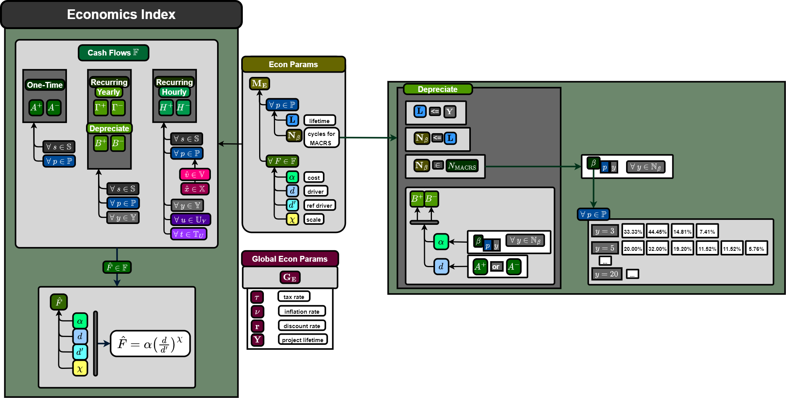

## ***Cashflow Definition***

Cash flows are defined to map resource-dependent component activities, capacities and market uncertainty to economic values. The engine for calculating economic metrics is the Tool for Economic Analysis (TEAL) which is a plugin in the FORCE toolset (more specifically, a plugin for RAVEN). Cash flows are defined by a universal formula:

$$ \hat{F} = \alpha \Big(\frac{d}{d^\prime}\Big)^\chi$$

where the individual terms are:

- $\alpha$: representative price or cost
- $d$: driver of the cash flow
- $d^\prime$: reference driver associated with the cost, if needed (usually 1)
- $\chi$: scaling factor representing economies ($0\leq\chi\leq1$) or diseconomies of scale ($\chi>1$)

A given cash flow is defined by a set of $(\alpha, d, d^\prime, \chi)$ values. Cash flows with $\chi\neq1$ typically introduce nonlinearities to any optimization problem but are still solvable by some open source solvers like IPOPT. A lot of cash flows are represented simply as $(\alpha, d, 1, 1)$.

The individual cash flow parameters $(\alpha, d, d^\prime, \chi)$ can be defined by static values or their value can be defined by other variables within the bi-level optimization. For example, a cash flow driver could be the capacity of a certain HERON Component (e.g., a plant or generator) or the dispatch activity determined at some time step (e.g., hourly).

## **Additional Cash Flow Modifications**

Cash flows can be modified based on tax rates and inflation rates per year of the project simulation. Tax and inflation can be applied on a per cash flow basis. Additionally a discount rate or weighted average cost of capital (WACC) can be introduced to determine the present value of future cash flows. Final cash flows can be summarized with the following formula for a given year $y$:

$$ F_y = \frac{1-\tau}{(1+\nu)^y (1+r)^y}\hat{F} $$

or, after some simplification,

$$ F_y = \frac{1-\tau}{(1+\nu+r+\nu r)^y}\hat{F} $$

where

- $\tau$: tax rate
- $\nu$: inflation rate
- $r$: discount rate or WACC

SInce tax and inflation is toggle-able for each defined cash flow in HERON, we can define indicator functions:

$$\tau_{p}^F = 1-\delta_{p}^{\tau}\tau$$

where

$$ \delta_{p}^{\tau} =
\begin{cases}
1\hspace{0.5cm} \text{if tax is applied for component } p \text{ and cash flow } F \text{ and no depreciation}\\
0\hspace{0.5cm} \text{elsewhere }
\end{cases}$$

and the inflation is applied similarly as

$$\nu_{p,y}^F = (1+ \delta_{p}^{\nu}\nu)^{-y} = \frac{1}{(1+ \delta_{p}^{\nu}\nu)^y}.$$

The user can specify whether each individual cashflow for each component are either taxable and/or should be inflated. With tax and inflation, we can introduce another shorthand with

$$\lambda_{p,y}^F = \tau_{p}^F \nu_{p,y}^F$$

which defaults to 1 in the case of no taxes or inflation. The final definition of cash flow is written as:
$$ F_y = \frac{\lambda_{p,y}^F}{(1+r)^y}\hat{F} $$

These get applied to the summed yearly cashflows. Note that cashflows are typically a function of dispatch or capacity in HERON:

$$F_y = f(\mathbf{c}, {}^s\mathbf{D}^\star)$$

## **Types of Cash Flows**

Three distinct groups of cash flows are defined in TEAL:

1. One-Time (and Depreciation)
2. Recurring Yearly
3. Recurring Hourly


### *One-Time*
One-time cash flows (e.g., capital expenditures or CAPEX) are applied once per lifetime of the component. Let's call the specific One-Time cashflow for Capital Expenditures, or CAPEX, $A$:

$$ \hat{F}^{one-time}_p \equiv A_p =  \alpha_p^A \left(\frac{c_p}{d^{A\prime}_p} \right)^{\chi^A_p}$$

Note that if component lifetimes are shorter than the total project simulation, these capital expenditures are repeated to simulate reconstruction costs. Reconstruction is assumed to happen instantaneously. We can use an indicator function to demonstrate this. Each component $p$ has a lifetime $L_p$. We define a set of integers dependent on whether the component lifetime is less than the project lifetime $Y$:

$$\mathbb{N}_p \in \mathbb{Z}^+$$

and

$$\mathbb{N}_p =
\begin{align*}
\begin{cases}
\{0\}\hspace{0.5cm} &\text{if } L_p > Y\\
\{0, 1\}\hspace{0.5cm} &\text{if } L_p = Y\\
\{0, 1, \ldots, \big\lfloor \frac{Y}{L_p} \big\rfloor \}\hspace{0.5cm} &\text{if } L_p < Y\\
\end{cases} \end{align*}$$

We define a function $\epsilon$ of the given year $y$ and component $p$ as

$$ \epsilon_{p,y}^A =
\begin{cases}
1\hspace{0.5cm} \text{if } y = nL_p \ \forall \ n \in \mathbb{N}_p\\
0\hspace{0.5cm} \text{elsewhere }
\end{cases}$$

which is equal to 1 when the year $y$ in consideration is a multiple of the component lifetime (starting with and including year 0). Then we can write the full CAPEX cost as a function not just of component but of year $y$:

$$ A_{p,y} =  \epsilon_{p,y}^A \alpha_p^A \left(\frac{c_p}{c^{A\prime}_p} \right)^{\chi^A_p}.$$

We can also differentiate between a positive and negative one-time cash flow:

$$ A_{p,y}^+,  A_{p,y}^-$$

#### *Depreciation*
Users have the option to apply depreciation to the Cash Flows (only for capital expenditures, really). The value of an asset deteriorates over time, so (per the IRS of the United States) there is a system to recover the depreciation of the asset's value over a set recovery period through tax credits. TEAL offers yearly depreciation rates according to the MACRS (modified accelerated cost recovery system) for 3-, 5-, 7-, 10-, and 15-year periods. In reality it is recovery time + 1 yr due to convention: the asset on the books is shown to have been purchased in the middle of the year no matter when the purchase happened, so there is an extra payment a year after the final year in the recovery period.

Say we select a recovery period $R_p$ for a component such that

$$R_p \leq L_p \leq Y $$

and

$$R_p \in \{3,5,7,10,15\}. $$

According to MACRS, we would have a depreciation rate $\beta_{p,y}$ per year. For example, for $R_p=3$ the rates would be

$$\beta_{p,y}\Big|_{R_p=3} =
\begin{cases}
33.33\hspace{0.5cm} \ \ \text{if } y = nL_p + 1 \ \forall \ n \in \mathbb{N}_p\\
44.45\hspace{0.5cm} \ \ \text{if } y = nL_p + 2 \ \forall \ n \in \mathbb{N}_p\\
14.81\hspace{0.5cm} \ \ \text{if } y = nL_p + 3 \ \forall \ n \in \mathbb{N}_p\\
7.41\hspace{0.7cm} \ \ \text{if } y = nL_p + 4\ \forall \ n \in \mathbb{N}_p\\
0\hspace{0.75cm} \ \ \text{elsewhere }
\end{cases}$$

Note that no depreciation is applied during the construction year $y=0$. Users can alternatively apply custom depreciation rate schedules. To model a depreciation asset, TEAL applies two additional cash flows to the one-time CAPEX. First is a positive cash flow representing the tax credit that helps recuperate the depreciation. It is untaxed, but inflation *is* applied:

$$B_{p,y}^+ = \beta_{p,y}\nu^B_{p,y}A_{p,0}.$$

Note that within $A_{p,0}$ is the term $\epsilon_{p,y}^A$ which applies the capital cost ONLY on the first year of construction (and subsequent reconstructions). In TEAL, the driver of the cash flow is the entire first year cash flow. Since $R_p \leq L_p$ only a singular capital cost is applied per component lifetime. For a more complete definition, we would repeat the depreciation process again per lifetime (this is accounted for in the definition of $\beta$).

A second, negative cash flow is also applied to represent the depreciation of the asset's value. This is similar to the first positive cash flow but it is taxed:

$$B_{p,y}^- = \beta_{p,y}\lambda^B_{p,y}A_{p,0}.$$

If we collect all like terms, the actual CAPEX cash flow will look like:

$$\begin{align*} \sum_{j=\{A,B\},\ k=\{+,-\}} F_j^k = -\lambda_{p,y}A_{p,y}^A + B_{p,y}^+ - B_{p,y}^- &= -\lambda_{p,y}^A A_y + \beta_{p,y}\nu^B_{p,y}A_{p,0} - \beta_{p,y}\lambda^B_{p,y}A_{p,0} \\
&= -\lambda^A_{p,y}A_y + \beta_{p,y}(\nu^B_{p,y} - \lambda^B_{p,y})A_{p,0} \\
&= -\lambda^A_{p,y}A_y + \beta_{p,y}\nu^B_{p,y}(1 - \tau^B_{p,y})A_{p,0}
\end{align*}$$

If levelized cost of capital is selected, we should also collect the amortization and depreciation terms in the "multiplied" column and divide the remainder cashflow sum by those terms.


### *Recurring Yearly*

There are fixed yearly expenditures that are typically just indexed by component for all years after first "construction" year:

```math
\hat{F}_{p,y}^\text{yearly} \equiv \Gamma_{p,y>0} = \alpha_p^\Gamma \left(\frac{c_p}{c_p^{\Gamma\prime}} \right)^{\chi_p^\Gamma}
```

or

$$\Gamma_{p,y} = \epsilon_y \alpha_p^{\Gamma} \left(\frac{c_p}{c_p^{\Gamma\prime}} \right)^{\chi_p^\Gamma} = \epsilon_y\alpha^{\Gamma}_p \left(\frac{c_p}{c_p^{\Gamma\prime}} \right)^{\chi_p^\Gamma}  $$

where we define a parameter to zero-out terms in year 0

$$\epsilon_{y} =
\begin{cases}
0\hspace{0.5cm} \ \text{if } y = 0 \ \forall \ y \in \mathbb{Y}\\
1\hspace{0.5cm} \ \text{elsewhere }
\end{cases}$$

These could potentially have different costs per year (e.g., $\alpha^{\Gamma}_{p,y}$). But for now only indexed by component and driven by the component capacity.

We can also differentiate between a positive and negative recurring yearly cash flow:

$$ \Gamma_{p,y}^+,  \Gamma_{p,y}^-$$

### *Recurring Hourly*

The final type of cashflows, which is the most complex, is the hourly recurring cashflows. In reality, the "yearly" and "hourly" cash flows should be classified as pertaining to some macro step size (years) and a pivot parameter (at a smaller resolution, could be 15-min). When HERON runs dispatch optimization and collects all chosen dispatch strategies, it sends to TEAL a yearly sum of these cashflows. For our definition, we retain the subscript $y$ for the generic cashflow $F$ but write it as
```math
\hat{F}_{p,y}^{hourly} \equiv H_{p,y>0} = \sum\limits_{x=0}^X \sum\limits_{u=0}^U m_{y,u} \sum\limits_{t=0}^T \alpha_{p,x,y,u,t}^H \left( \frac{D_{p,x,y,u,t}}{D_{p,x,y,u,t}^{H \prime}} \right)^{\chi_{p,x,y,u,t}^H}
```

where $m_{y,u}$ is the multiplicity per cluster. This is an all-encompassing generic definition for an hourly cashflow. Note that the cashflow driver is no longer capacity, rather the dispatch (or production) of a given resource per component and time. Time is indexed further by year, cluster, and hour. Because it looks complex to explicitly specify all five indeces, we could instead use a notation

$$i \equiv \{p,x,y,u,t\}$$

and the $\epsilon_y$ parameter from the recurring yearly cash flow so that

$$H_{p,y} = \epsilon_y \sum\limits_{x=0}^X \sum\limits_{u=0}^U m_{y,u} \sum\limits_{t=0}^T \alpha_{i}^H \left( \frac{D_{i}}{D_{i}^{H\prime}} \right)^{\chi_{i}^H}$$

as a shorthand to demonstrate that we're indexing by all five indeces $\{p,x,y,u,t\}$. Note also that for every cluster, we are multiplying by its associated multiplicity: the amount of segments each cluster is meant to represent. This multiplicity may vary by year and cluster, but note that the number of clusters $U$ will not.
