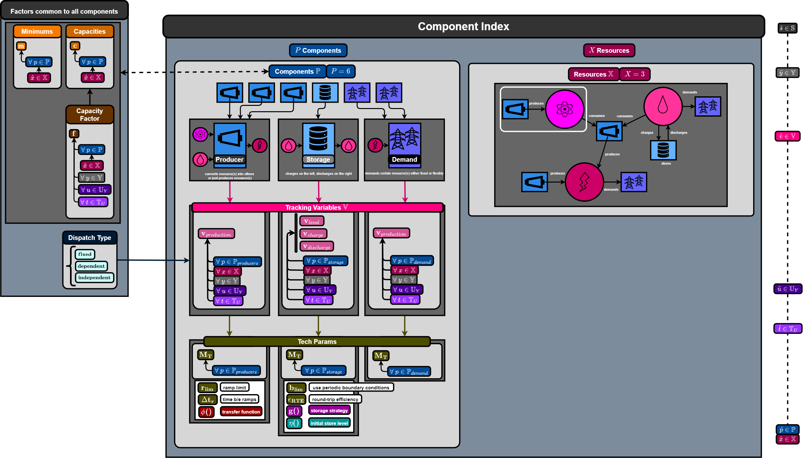

## ***Component Capacities***
We first define variables in our problem. Each component has the capability to perform three actions on a resource:
  1) store,
  2) demand,
  3) produce or consume+produce.

Each component can only perform one of those three actions. If it produces/consumes, then it can perform the action on multiple resources with a given transfer function that describes the conversion of a set $A$ of resources into another set $B$ of resources. For these given actions, the component will have a maximum value at which they can perform this action: these are capacities which, when collected for all components, is given as a vector
$$\bm{c} = \big[ \ c_p : p \in \mathbb{P}^\prime\ \big]. $$

Note that we are considering only the set of components that store or produce here, $\mathbb{P}^\prime \in \mathbb{P}$. This is closer to the definition of an IES; the difference is that within HERON we must include a resource sink for the resources to go to fulfill a demand or get sold. The demanding resources within HERON are typically markets or grids which are not typically a part of the IES but must be defined to conduct the simulation. We may be able to include the capacity of the market as an additional variable...

## ***Component Minimums and Capacity Factors***
There are optional inputs for all components to define the minimum level of production or resource activity. If not specified, the default is 0.
$$\bm{m} = \big[ \ m_p : p \in \mathbb{P}^\prime\ \big]. $$

Additionally, capacity factors can be used to modify the upper bound of production on an hourly time scale.
$$\bm{f} = \big[ \ \big[\ \big[ \ \big[ f_{p,y,u,t} : t \in \mathbb{T} \ \big] : u \in \mathbb{U}_Y \ \big] : y \in \mathbb{Y}  \ \big]   : p \in \mathbb{P}^\prime\ \big]. $$

## ***Transfer Functions***
Only Producer components have the option to declare a transfer function which defines how a subset of resources is converted into another set. Three type of transfer functions are allowed:

  1) Ratio/Linear
  2) Polynomial
  3) Function

### *Ratio*
The ratio transfer function mimics a chemical equation of the type
$$3a + 7b \rightarrow 2c$$
In this case, the production of resource $c$ is 3:2 with respect to resource $a$ and 7:2 with respect to resource $b$.

### *Polynomial*
Users can also define a polynomial relationship between the different resources. for example
$$2a^2 + 3ab -b^2 + ba^3 = 0 $$

### *Function*
Custom Python methods are also allowed to be used to define the transfer relationship from one subset of resources to another.

## ***Dispatch Activity***
The actual action the component takes on resources per timestep is referred to as the dispatch activity and can be indexed similarly for each component by the resource being acted on as well as the time. We subdivide the time into years, then into clustered segments and then into a smaller timestep (typically hours per year).  The dispatch matrix is
$${}^s\bm{D}^\star = \big[ \ \big[ \ \big[\ \big[ \ \big[ {}^sD^\star_{p,x,y,u,t} : t \in \mathbb{T} \ \big] : u \in \mathbb{U}_Y \ \big] : y \in \mathbb{Y}  \ \big] : x \in \mathbb{X} \ \big]: p \in \mathbb{P}^\prime \ \big]$$

For the different component types, the dispatch activity is tracked via the following dispatch optimization variables:
  1) Producer $\rightarrow$ production
  2) Demand $\rightarrow$ production
  3) Storage $\rightarrow$ [level, charge, discharge]

The capacities are applied as a global upper bound on the dispatch when defined as flexible:

$$ m_p \leq D_{p,x,y,u,t} \leq f_{p,y,u,t} c_p \ \forall \ \begin{cases} p \in \mathbb{P}^\prime \\ x\in \mathbb{X} \\ y\in \mathbb{Y} \\u\in \mathbb{U}_Y \\t\in \mathbb{T} \end{cases}  $$

The minimum $m_p$ defaults to 0 unless specified; the capacity factor $f_{p,y,u,t}$ defaults to 1. In the default case, the bounds on dispatch are:

$$ 0 \leq D_{p,x,y,u,t} \leq c_p \ \forall \ \begin{cases} p \in \mathbb{P}^\prime \\ x\in \mathbb{X} \\ y\in \mathbb{Y} \\u\in \mathbb{U}_Y \\t\in \mathbb{T} \end{cases}  $$

Otherwise the components will just dispatch at a fixed level based on their capacity. We can also define the specific collection of dispatch actions taken within a specific scenario (i.e., for a given stochastic profile) as

$${}^s\bm{D} \equiv \bm{D}(s)$$

or perhaps more explicitly,

$${}^s\bm{D} \equiv \bm{D}({}^s\bm{W})$$

where we're not exactly indexing per scenario, it's perhaps more of a response of the dispatch to a given scenario $s$ and denote it as shown above.

$$ {}^sD^\star_{p,x,\hat{y},\hat{u},t} = \argmax_D \ \sum_{P,X,T_{U}} {}^s\hat{F}_{hourly} \Big|_{\hat{u},\hat{y}} $$
