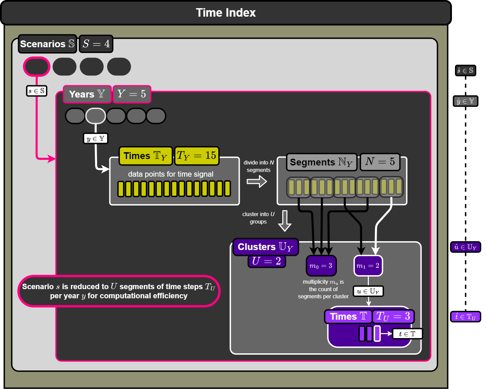

### *Time Indexing*
Consider a generator of stochastic profiles. We want $S$ profiles each indexed by $s \in \mathbb{S}$. Each profile consists of $Y$ years, each year with $T_Y$ total time steps. We can subdivide the year into $N$ segments each with a length of $T_U$. To do this, we first ensure that

```math
T_Y = N T_U
```

where $N$ is an integer number. One example of this is to have individual time steps of 1 hour, so that $T_Y = 8760$, and then divide the year into segments corresponding to days so that $T_U = 24$ and $N=365$ (ignoring leap years). One could also group instead by every 48 hours, every week, month, etc. as long as the number multiplies into $T_Y$ evenly.

After training the synthetic history generator on each segment of each year, a clustering algorithm can determine how best to group the segments into $U$ unique groups each indexed by $u \in \mathbb{U}_Y$. If $\mathbb{N}_Y$ is the set of all segments per year, we would then have $U$ unique subsets of segments

```math
\mathbb{N}_u \subset \mathbb{N}_Y \ \ \forall u \in \mathbb{U}_Y
```

and

```math\{\ \cup \ \mathbb{N}_u \ | u \in \mathbb{U}_Y \}=\mathbb{N}_Y
```

We can collect the number of segments each cluster represents as a multiplicity vector:

```math$\mathbf{m} = [\ \ \text{len}(\mathbb{N}_u) \ | \ u \in \mathbb{U}_Y \ ]
```

The stochastic profiles which will be returned from the trained model will then have a shape of $Y \times U \times T$ and is given as

```math
{}^s\mathbf{W}
```

for a given evaluation $s$ of some stochastic profile generator. The value of the synthetic signal at some timestep $t$ of cluster $u$ during year $y$ is indexed as

```math
 {}^s\mathbf{W}_{y,u,t}
 ```

This stochastic profile could have an additional dimension if multiple signals are produced in one profile.

