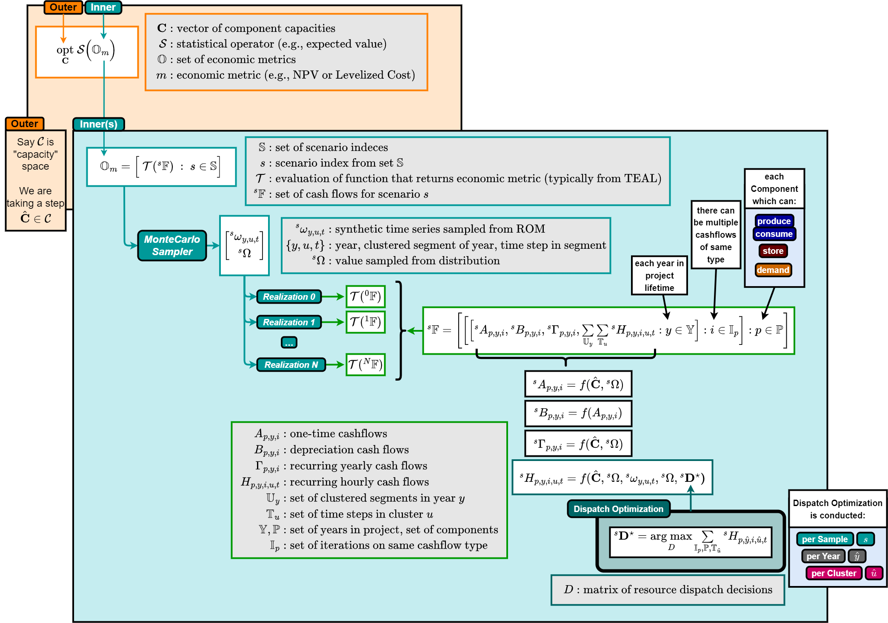

## HERON Modes for `standard` Workflow
For RAVEN-runs-RAVEN (`standard`) mode, users can select:
- `Opt` Mode
- `Sweep` Mode

Additionally, users can overwrite either of these modes with:
- `Debug` Mode
  - runs limited case and produces diagrams for given IES configuration

## Outer Level
In the outer level, regardless of HERON mode (`opt` or `sweep`), we calculate some statistic of a set of economic metrics:
$$\mathcal{S}( \mathbb{O} )$$
where $\mathcal{S}$ is the statistical metric and $\mathbb{O}$ is a set of economic metrics.

### *Sweep Mode*

If selecting sweep mode, the outer level runs a parametric sweep over a list of capacity values $c$ as:
$$ \underset{\mathbf{c}}{\text{sweep}} \ \ \mathcal{S}( \mathbb{O} )$$

Multiple statistics can be reported back per iteration within the parametric sweep, shown here for $K$ different statistics (e.g., expected value, minimum, 95% percentile):
$$ \underset{\mathbf{c}}{\text{sweep}} \ \ \Big[\mathcal{S}_0( \mathbb{O} ), \ \mathcal{S}_1( \mathbb{O} ), \ ..., \ \mathcal{S}_K( \mathbb{O} ) \Big]$$

Additionally, and only in sweep mode, HERON can report back multiple economic metrics, shown below for $M$ different metrics:

$$ \underset{\mathbf{c}}{\text{sweep}} \ \ \begin{bmatrix} \mathcal{S}_0( \mathbb{O}_0 ), \ \mathcal{S}_1( \mathbb{O}_0 ), \ ..., \ \mathcal{S}_K( \mathbb{O}_0 ) \\ \vdots \\ \mathcal{S}_0( \mathbb{O}_M ), \ \mathcal{S}_1( \mathbb{O}_M ), \ ..., \ \mathcal{S}_K( \mathbb{O}_M ) \end{bmatrix} $$

NOTE: multiple metrics is not available when selecting levelized cost. Selection for other metrics is limited to NPV, IRR, and PI.

### *Opt Mode*

If selecting opt mode, the outer level uses an optimizer algorithm to determine a set of capacities which optimize (either maximize or minimize) some objective function. Currently, the available optimization algorithms are:

1) Gradient Descent
2) Bayesian Optimization (default)

Regardless of optimization method, the overall problem is stated as

$$ \underset{\mathbf{c}}{\text{opt}} \ \ \mathcal{S}( \mathbb{O}_m )$$

where:

- $\mathbf{c}$ : component (e.g., nuclear, wind turbines) capacities
- $\mathcal{S}$ : statistical operator (e.g., expected value, value at risk)
- $\mathbb{O}_m$ : a set of economic metrics from individual inner realizations
- $m$ : subscript for some economic metric (e.g., net present value, levelized cost)
- $\mathbf{c}^\star$ : optimal set of capacities for the given objective

Depending on the statistical metric (and even moreso the economic metric), the direction of optimization changes. For example if the economic metric is the net present value, if the statistical metric is expected value then we would want to maximize:
$$ \underset{\mathbf{c}}{\text{max}} \ \ \mathbb{E}( \mathbb{O}_{NPV} )$$

If the statistic is the value-at-risk of the distribution at a given probability level, we'd want to minimize:
$$ \underset{\mathbf{c}}{\text{min}} \ \ \mathbb{V}_{0.05}( \mathbb{O}_{NPV} )$$

The optimal set of capacities for the given objective is

$$ \mathbf{c}^\star = \argmax_{\mathbf{c}} \ \mathcal{S}( \mathbb{O}_{NPV} )$$

## Inner Level

We build up that set of economic metrics for a set of possible scenarios/realizations.

$\mathbb{O}_m = \Big[ \ \mathcal{T}(\mathbb{{}^sF}) \ :  \ s \in \mathbb{S} \Big]$

- $\mathbb{S}$ : set of scenario indeces, size $S$
- $s$ : given scenario from $\mathbb{S}$
- $\mathbb{{}^sF}$ : set of cashflows per scenario (collected over all components, all years, all hours)
- $\mathcal{T}( )$ : evaluation of a function resulting in an economic metric (typically from a plugin called TEAL)

where $\mathbb{S}$ is a set of scenarios, ${}^s\mathbb{F}$ is a set of cashflows per scenario, and $\mathcal{T}( )$ is an evaluated economic metric (from TEAL). The typical is...

$\mathbb{O}_{NPV} = \Big[ \ NPV(\mathbb{{}^sF}) \ : \ s \in \mathbb{S} \Big]$

### for a given scenario ($s$)

the set of all cashflows for that scenario is

$\mathbb{{}^sF} = \Bigg[ \bigg[ \Big[{}^s\mathbb{F}_{p,F,i} : p \in \mathbb{P} \Big]: F \in \big[A, B, \Gamma, H \big]\bigg] \ : i \in [+,-] \Bigg ]$

or in other words it is a collection of all cashflow types $F$, either positive or negative, for all components. We can define the set by all cashflow types (each are indexed by years in different ways):

$A_p^i \equiv {}^s\mathbb{F}_{p,i}|_{{}_{F=A}}$

$\Gamma_{p,y}^i \equiv {}^s\mathbb{F}_{p,y,i}|_{{}_{F=\Gamma}}$

etc.

$\mathbb{{}^0F} = \Bigg[ \bigg[ A^i_{p}, \ \Big[ B^i_{p,y}, \ \Gamma^i_{p,y}, \ \sum\limits_{\mathbb{U}_y} \sum\limits_{\mathbb{T}_u} H^i_{p,y}   \ :  \ y \in \mathbb{Y}  \Big] \ :  \ p \in \mathbb{P} \  \bigg ] \ i \in [+,-] \Bigg ]$

then the NPV is a linear combination of all cashflows

$NPV(\mathbb{{}^0F} ) = \sum\limits_{{}^0F \in \mathbb{{}^0F}} {}^0F = \sum\limits_{p \in \mathbb{P}}\sum\limits_{y \in \mathbb{Y}} {}^0F_{p,y} = \sum\limits_{p \in \mathbb{P}}\sum\limits_{y \in \mathbb{Y}} {}^0F_{p,y}$

and each cashflow is

${}^0F_{p,y} = \xi_{p,y} \alpha_{p,y} \Big(\frac{d_{p,y}}{d^\prime_{p,y}}\Big)^{\chi_{p,y}}$

where

$\xi_{p,y} = \frac{1-\epsilon_{p,F}^\tau \tau}{(1+r)^y (1+\epsilon_{p,F}^\nu \nu)^y} = \frac{1-\epsilon_{p,F}^\tau \tau}{(1+r+\epsilon_{p,F}^\nu \nu + r\epsilon_{p,F}^\nu \nu)^y}$

where the $\epsilon$ terms are just a boolean, to toggle if the component cashflow is meant to be taxed ($\tau$) and/or have annualized inflation $\nu$. Each cashflow has an annualized discount rate $r$.

